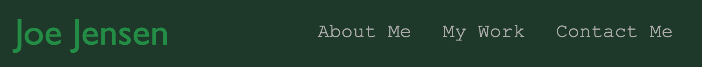

# Personal Portfolio

## Description 

This repository contains a personal portfolio of my work. It features a responsive layout, as well as some hover effects. And of course, other examples of my work.

This repository utilizes
* HTML
* CSS

[Deployed Site](https://joedjensen.github.io/personal-portfolio/)

## Installation 
N/A

## Usage 

Please use this website to examine my other work and get in touch with me!

What follows is a brief description of some of the interesting bits of work present within the site itself.
### Computer Layout
When viewed on a computer sized display, navigation bar and contact me information are listed out side by side, and the body of the website has 2 columns.

The projects in the portfolio are laid out with 1 large image above 4 small images arranged in a 2x2 grid.

### Tablet Layout

When viewed on a tablet sized display, the body is convered to a single column layout. The images within the portfolio maintian the same alignment, but are halved in height.

### Mobile

When viewed on mobile, the nav bar and contact me stack!

Additionally, small images within the portfolio go full width to account for the smaller screen

## License

Please refer to the license in the repo

